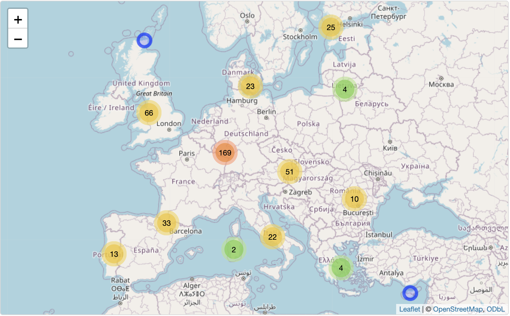

# EU-Green-Energy-Projects
Analysing funding allocated for research and innovation to universities across EU nations with high carbon emissions to localise and better understand green initiatives and how future partnerships can be developed.

This project follows the BDTI Essentials course using R instead of KNIME: https://code.europa.eu/bdti/bdti-essentials-course
Some of my visualisations differ from those in the course due to package limitation with R and an update in the data, but the conclusions drawn are largely similiar. I also inlcuded a couple of my own questions for analysis that weren't covered in the course.

## Datasets (open data sources)
1) Horizon projects from data.europa.eu 2014-2020
These datasets contain information about projects and their results funded by the European Union under the Horizon 2020 framework programme.
https://data.europa.eu/data/datasets/cordish2020projects?locale=en

File Names
euroSciVoc_2020.xlsx (excel)
organization_2020.csv (csv)
project_2020.json (json)

Horizon 2021 - 2027
https://data.europa.eu/data/datasets/cordis-eu-research-projects-under-horizon-europe-2021-2027?locale=en

File Names
euroSciVoc_2021.xlsx (excel)
organization_2021.csv (csv)
project_2021.json (JSON)

2) Official European Union Country Names from Eurostat
https://ec.europa.eu/eurostat/statistics-explained/images/9/9f/Country_Codes_and_Names.xlsx

File Name
Country_Codes_and_Names.xlsx

3) CO2 emissions from Our World in Data
https://ourworldindata.org/co2-emissions
https://github.com/owid/co2-data

File Name
owid-co2-data.csv (csv)

4) Open Street Map API - Nominatim
https://nominatim.openstreetmap.org/ui/search.html
